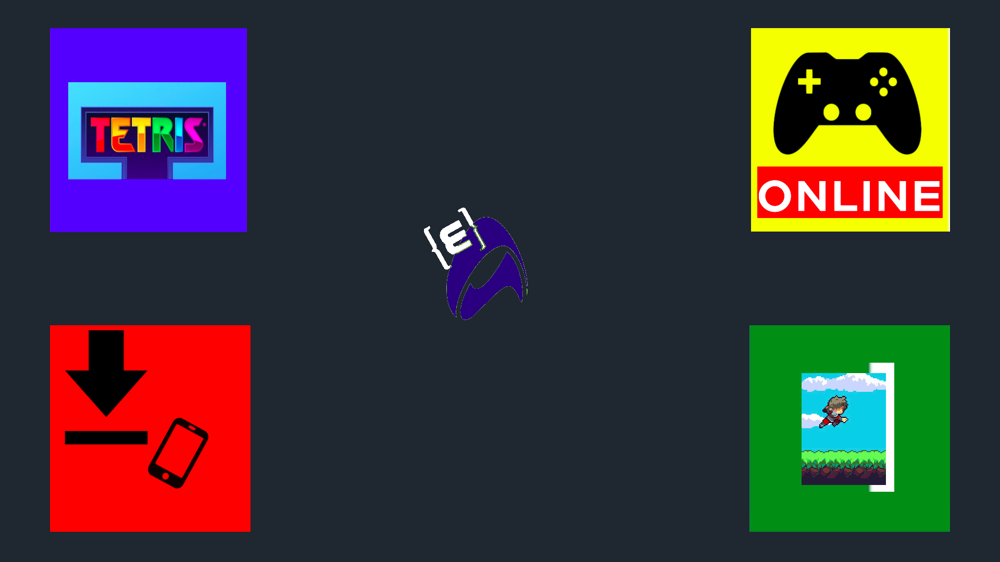
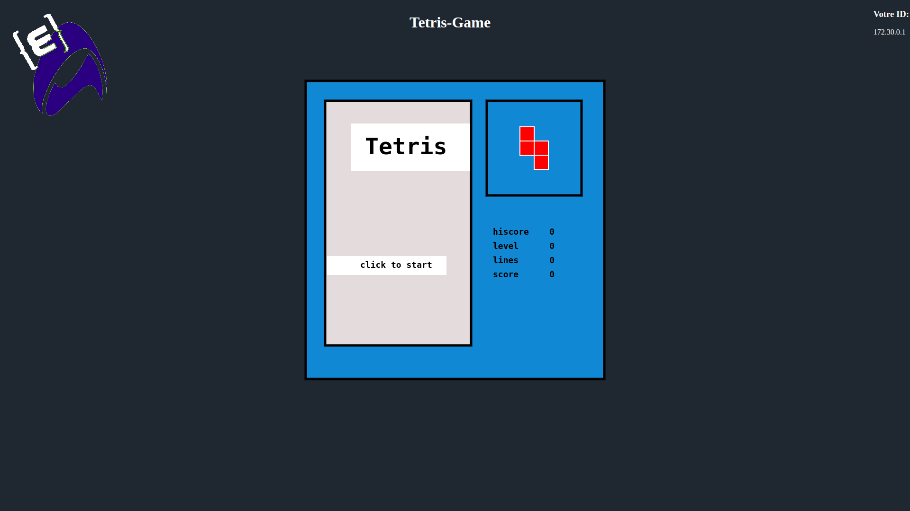
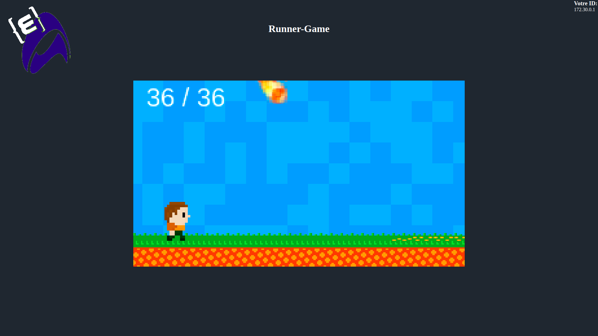
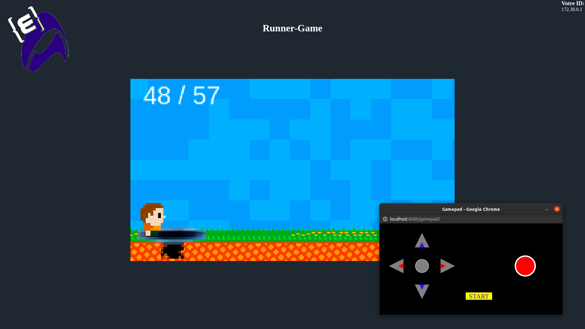

# YEP_project2_2019

To launch EPIAIRCONSOLE

Make sure that "docker-compose" is installed on your computer
Open the folder Delivery and execute this command in your shell:

sudo docker-compose up --build

After building you can launch your browser and go to this adress "http://localhost:8080/"

### Home Page

### Game 1 : Tetris

### Game 2 : Runner

### Web Gamepad

